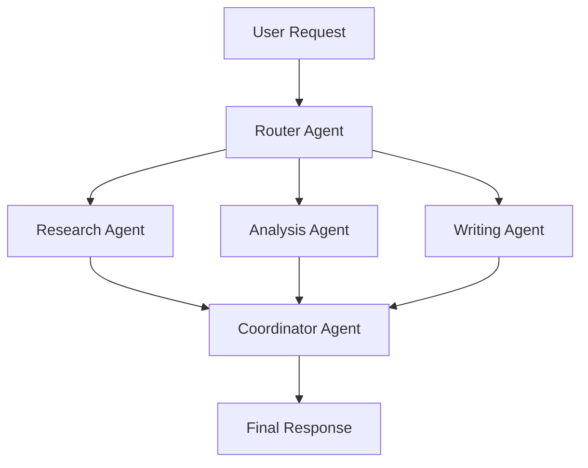

## Custom Agents

Create and deploy specialized AI agents that are purpose-built for your specific tasks, industries, or workflows. Each agent can have unique capabilities, knowledge, and behaviors.

<Card
  title="Try Custom Agents"
  icon="play"
  href="https://app.keinsaas.com"
  horizontal
>
  Experience custom agents in action with our live demo.
</Card>

## What are Custom Agents?

Custom agents are specialized AI assistants designed for specific tasks or domains. Unlike general-purpose chatbots, custom agents are trained and configured to excel in particular areas, providing more accurate and relevant responses.

### Key Benefits

<Columns cols={2}>
  <Card
    title="🎯 Specialized Expertise"
    icon="target"
  >
    Each agent is optimized for specific tasks, providing deeper knowledge and better results.
  </Card>
  <Card
    title="⚡ Faster Response Times"
    icon="bolt"
  >
    Pre-configured agents respond faster than general-purpose models for their specialized tasks.
  </Card>
  <Card
    title="🔧 Customizable Behavior"
    icon="cog"
  >
    Fine-tune agent personality, tone, and response patterns to match your needs.
  </Card>
  <Card
    title="📊 Domain-Specific Tools"
    icon="wrench"
  >
    Equip agents with specialized tools and knowledge bases for their domain.
  </Card>
</Columns>

## Types of Custom Agents

### Business Agents

<AccordionGroup>
  <Accordion icon="chart-line" title="Sales Agent">
    **Purpose**: Assist with sales processes and customer interactions
    
    **Capabilities**:
    - Lead qualification and scoring
    - Product recommendations
    - Pricing and proposal generation
    - Customer objection handling
    - Follow-up scheduling and reminders
  </Accordion>
  <Accordion icon="users" title="Customer Support Agent">
    **Purpose**: Provide efficient customer service and support
    
    **Capabilities**:
    - Ticket classification and routing
    - Common issue resolution
    - Escalation management
    - Knowledge base search
    - Customer satisfaction tracking
  </Accordion>
  <Accordion icon="handshake" title="HR Agent">
    **Purpose**: Streamline human resources processes
    
    **Capabilities**:
    - Resume screening and candidate evaluation
    - Interview scheduling and coordination
    - Employee onboarding assistance
    - Policy clarification and guidance
    - Performance review support
  </Accordion>
</AccordionGroup>

### Technical Agents

<AccordionGroup>
  <Accordion icon="code" title="Code Review Agent">
    **Purpose**: Assist with code quality and best practices
    
    **Capabilities**:
    - Code analysis and suggestions
    - Security vulnerability detection
    - Performance optimization recommendations
    - Documentation generation
    - Testing strategy guidance
  </Accordion>
  <Accordion icon="bug" title="Debugging Agent">
    **Purpose**: Help identify and resolve technical issues
    
    **Capabilities**:
    - Error analysis and diagnosis
    - Log file interpretation
    - Root cause analysis
    - Solution recommendations
    - Testing and validation support
  </Accordion>
  <Accordion icon="cloud" title="DevOps Agent">
    **Purpose**: Support deployment and infrastructure management
    
    **Capabilities**:
    - Deployment pipeline optimization
    - Infrastructure monitoring
    - Incident response coordination
    - Performance tuning
    - Security compliance checking
  </Accordion>
</AccordionGroup>

### Creative Agents

<AccordionGroup>
  <Accordion icon="pen-fancy" title="Content Writing Agent">
    **Purpose**: Create and optimize written content
    
    **Capabilities**:
    - Blog post and article writing
    - Social media content creation
    - Email campaign development
    - SEO optimization
    - Brand voice consistency
  </Accordion>
  <Accordion icon="paint-brush" title="Design Agent">
    **Purpose**: Assist with visual design and creative tasks
    
    **Capabilities**:
    - Logo and branding design
    - Web page layout suggestions
    - Color scheme recommendations
    - Typography selection
    - Design trend analysis
  </Accordion>
  <Accordion icon="video" title="Marketing Agent">
    **Purpose**: Support marketing strategy and execution
    
    **Capabilities**:
    - Campaign planning and strategy
    - Target audience analysis
    - Content calendar management
    - Performance metrics tracking
    - A/B testing recommendations
  </Accordion>
</AccordionGroup>

## Creating Your First Custom Agent

### Step 1: Define Your Agent's Purpose

<Steps>
  <Step title="Identify the Task">
    What specific problem will your agent solve? Be as specific as possible.
  </Step>
  <Step title="Define Success Metrics">
    How will you measure if your agent is successful?
  </Step>
  <Step title="Identify Required Knowledge">
    What information and tools does your agent need?
  </Step>
  <Step title="Set Behavioral Guidelines">
    How should your agent interact with users?
  </Step>
</Steps>

### Step 2: Configure Agent Settings

<AccordionGroup>
  <Accordion icon="user" title="Personality & Tone">
    Configure how your agent communicates:
    
    - **Professional**: Formal, business-appropriate language
    - **Friendly**: Casual, approachable tone
    - **Technical**: Precise, detailed explanations
    - **Creative**: Engaging, imaginative responses
  </Accordion>
  <Accordion icon="brain" title="Knowledge Base">
    Provide your agent with specialized knowledge:
    
    - Upload relevant documents
    - Connect to databases
    - Link to external resources
    - Define domain-specific terminology
  </Accordion>
  <Accordion icon="tools" title="Tool Integration">
    Equip your agent with necessary tools:
    
    - MCP server connections
    - API integrations
    - Database access
    - File processing capabilities
  </Accordion>
</AccordionGroup>

### Step 3: Train and Test

1. **Provide Training Data**: Upload examples of good interactions
2. **Test with Sample Queries**: Try various scenarios and edge cases
3. **Refine Responses**: Adjust settings based on test results
4. **Deploy and Monitor**: Launch your agent and track performance

## Advanced Agent Features

### Multi-Agent Workflows

Create teams of agents that work together:

### Agent Memory and Learning

<Columns cols={2}>
  <Card
    title="🧠 Conversation Memory"
    icon="brain"
  >
    Agents remember context across conversations for better continuity.
  </Card>
  <Card
    title="📈 Performance Learning"
    icon="chart-line"
  >
    Agents improve over time based on user feedback and interaction patterns.
  </Card>
  <Card
    title="🔄 Knowledge Updates"
    icon="sync"
  >
    Automatically update agent knowledge with new information and best practices.
  </Card>
  <Card
    title="🎯 Personalization"
    icon="user"
  >
    Adapt agent behavior based on individual user preferences and history.
  </Card>
</Columns>

### Agent Collaboration

Enable agents to work together on complex tasks:

- **Handoff Protocols**: Seamlessly transfer conversations between agents
- **Shared Context**: Maintain information across agent transitions
- **Specialized Expertise**: Each agent contributes their unique capabilities
- **Quality Assurance**: Multiple agents can review and validate responses

## Best Practices

### Agent Design

<AccordionGroup>
  <Accordion icon="target" title="Focus on Specificity">
    Create agents that excel at specific tasks rather than trying to do everything.
  </Accordion>
  <Accordion icon="test-tube" title="Test Extensively">
    Thoroughly test your agents with various scenarios before deployment.
  </Accordion>
  <Accordion icon="book" title="Document Capabilities">
    Clearly document what each agent can and cannot do for users.
  </Accordion>
  <Accordion icon="chart-bar" title="Monitor Performance">
    Track agent performance and user satisfaction to identify improvement opportunities.
  </Accordion>
</AccordionGroup>

### User Experience

- **Clear Expectations**: Let users know what each agent specializes in
- **Easy Access**: Make it simple to switch between different agents
- **Consistent Quality**: Ensure all agents maintain high standards
- **Feedback Loops**: Provide ways for users to improve agent performance

## Agent Templates

Get started quickly with pre-built agent templates:

<CardGroup cols={2}>
  <Card title="Customer Service" icon="headset" href="/guides/agent-templates/customer-service">
    Template for customer support and service agents
  </Card>
  <Card title="Content Creator" icon="pen-fancy" href="/guides/agent-templates/content-creator">
    Template for content writing and creation agents
  </Card>
  <Card title="Data Analyst" icon="chart-bar" href="/guides/agent-templates/data-analyst">
    Template for data analysis and reporting agents
  </Card>
  <Card title="Technical Support" icon="wrench" href="/guides/agent-templates/technical-support">
    Template for technical assistance and troubleshooting agents
  </Card>
</CardGroup>

## Getting Help

<Card
  title="Agent Development Support"
  icon="headset"
  href="mailto:support@keinsaas.com"
  horizontal
>
  Need help creating your first custom agent? Our team can guide you through the process.
</Card>

<Note>
  **Pro Tip**: Start with a simple agent focused on one specific task, then gradually add more capabilities as you become comfortable with the platform.
</Note>
