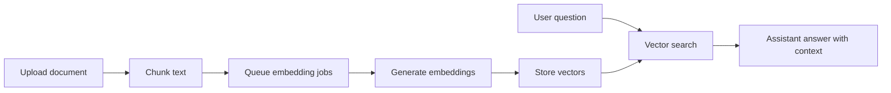

Navigator can use project documents as retrieval context. Uploaded documents are chunked, embedded, stored, and searched when the assistant needs grounded answers from your files.

## Retrieval flow



## Setup outline

<Steps>
  <Step title="Enable Supabase extensions">
    Run the project migrations that enable pgvector, pgmq, pg_cron, and the RAG utility functions.
  </Step>
  <Step title="Deploy the embed function">
    Deploy the Supabase Edge Function used to generate embeddings asynchronously.
  </Step>
  <Step title="Configure secrets">
    Add Supabase credentials and any optional AI Gateway settings.
  </Step>
  <Step title="Upload and test">
    Upload a document, monitor embedding progress, then ask a question that should retrieve from that document.
  </Step>
</Steps>

## Search endpoints

```http
POST /api/projects/{projectId}/search
GET /api/projects/{projectId}/status
POST /api/knowledge-base/search
```

<Tip>
  Use project-specific search when a thread should only draw from one archive or customer workspace. Use global search for broad personal knowledge lookup.
</Tip>
