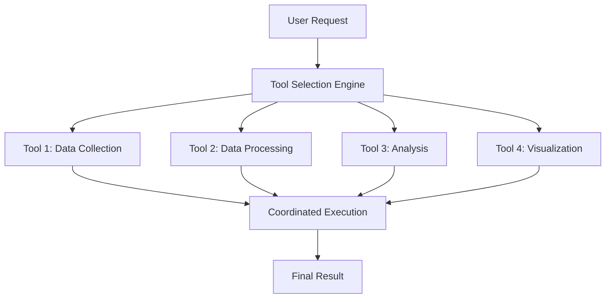

## Tool Choice Mode

Experience intelligent tool selection that automatically chooses the best tools for your tasks based on context, conversation history, and your preferences. No more guessing which tool to use - let the AI make the smart decisions.

<Card
  title="Try Tool Choice Mode"
  icon="play"
  href="https://app.keinsaas.com"
  horizontal
>
  Experience intelligent tool selection in our live demo.
</Card>

## What is Tool Choice Mode?

Tool Choice Mode is an intelligent system that automatically selects the most appropriate tools for your requests without requiring you to specify which tools to use. The system analyzes your request, considers available tools, and makes smart decisions about which tools will best serve your needs.

### Key Benefits

<Columns cols={2}>
  <Card
    title="🧠 Intelligent Selection"
    icon="brain"
  >
    AI automatically chooses the best tools based on context and requirements.
  </Card>
  <Card
    title="⚡ Faster Workflow"
    icon="bolt"
  >
    No need to manually select tools - just describe what you need.
  </Card>
  <Card
    title="🎯 Context Aware"
    icon="target"
  >
    Tool selection adapts based on conversation history and current context.
  </Card>
  <Card
    title="📈 Learning System"
    icon="chart-line"
  >
    System learns from your preferences and improves over time.
  </Card>
</Columns>

## How Tool Choice Mode Works

### Automatic Tool Selection

When you make a request, the system:

1. **Analyzes Your Request**: Understands what you're trying to accomplish
2. **Evaluates Available Tools**: Reviews all available MCP tools and capabilities
3. **Considers Context**: Takes into account conversation history and current state
4. **Makes Smart Decisions**: Selects the optimal combination of tools
5. **Executes Seamlessly**: Runs the tools automatically without user intervention

### Example Scenarios

<AccordionGroup>
  <Accordion icon="search" title="Research Request">
    **User says**: "I need to research the latest trends in renewable energy"
    
    **System automatically**:
    - Uses web search tool to find current information
    - Applies data analysis tools to identify patterns
    - Generates visualizations to present findings
    - Creates a comprehensive summary report
  </Accordion>
  <Accordion icon="chart-bar" title="Data Analysis Request">
    **User says**: "Analyze this sales data and show me the key insights"
    
    **System automatically**:
    - Uses data processing tools to clean and prepare data
    - Applies statistical analysis tools
    - Generates appropriate charts and visualizations
    - Provides detailed insights and recommendations
  </Accordion>
  <Accordion icon="code" title="Code Development Request">
    **User says**: "Create a function to validate email addresses"
    
    **System automatically**:
    - Uses code generation tools for the specific language
    - Applies testing tools to validate the function
    - Generates documentation for the code
    - Provides usage examples and best practices
  </Accordion>
</AccordionGroup>

## Tool Selection Intelligence

### Context Analysis

The system considers multiple factors when selecting tools:

<Columns cols={2}>
  <Card
    title="💬 Conversation Context"
    icon="comments"
  >
    Analyzes the current conversation to understand ongoing topics and goals.
  </Card>
  <Card
    title="📊 Data Types"
    icon="database"
  >
    Identifies the types of data involved and selects appropriate processing tools.
  </Card>
  <Card
    title="🎯 User Intent"
    icon="target"
  >
    Determines the underlying intent behind the request to choose relevant tools.
  </Card>
  <Card
    title="⚙️ Tool Capabilities"
    icon="wrench"
  >
    Evaluates available tool capabilities and their suitability for the task.
  </Card>
</Columns>

### Learning and Adaptation

<AccordionGroup>
  <Accordion icon="brain" title="Usage Patterns">
    **The system learns from**:
    
    - Which tools you prefer for specific tasks
    - How you typically structure requests
    - Your success patterns with different tool combinations
    - Your feedback on tool selections
  </Accordion>
  <Accordion icon="chart-line" title="Performance Optimization">
    **Continuous improvement through**:
    
    - Tracking tool effectiveness for different request types
    - Analyzing user satisfaction with tool selections
    - Optimizing tool combinations for better results
    - Adapting to changing user needs and preferences
  </Accordion>
</AccordionGroup>

## Tool Choice Modes

### Automatic Mode (Default)

The system makes all tool selections automatically:

- **Best for**: Most users and general use cases
- **Benefits**: Maximum convenience and speed
- **Considerations**: Less control over specific tool usage

### Guided Mode

The system suggests tools but asks for confirmation:

- **Best for**: Users who want some control
- **Benefits**: Balance of automation and control
- **Considerations**: Slightly slower but more transparent

### Manual Mode

You specify tools explicitly:

- **Best for**: Advanced users with specific requirements
- **Benefits**: Complete control over tool selection
- **Considerations**: Requires knowledge of available tools

## Customizing Tool Choice Behavior

### Setting Preferences

<Steps>
  <Step title="Access Settings">
    Go to Settings → Tool Choice → Preferences
  </Step>
  <Step title="Choose Mode">
    Select Automatic, Guided, or Manual mode
  </Step>
  <Step title="Set Tool Preferences">
    Configure preferred tools for specific task types
  </Step>
  <Step title="Configure Learning">
    Set how aggressively the system should learn from your usage
  </Step>
</Steps>

### Tool Priority Settings

<AccordionGroup>
  <Accordion icon="star" title="Favorite Tools">
    **Mark tools as favorites**:
    
    - Tools you prefer will be prioritized in selection
    - Useful for tools you trust and use frequently
    - Can be set globally or per task type
  </Accordion>
  <Accordion icon="ban" title="Excluded Tools">
    **Exclude tools from automatic selection**:
    
    - Tools you don't want used automatically
    - Useful for experimental or specialized tools
    - Can be temporarily or permanently excluded
  </Accordion>
  <Accordion icon="cog" title="Tool Combinations">
    **Define preferred tool combinations**:
    
    - Set up common tool workflows
    - Specify which tools work well together
    - Create custom tool chains for specific tasks
  </Accordion>
</AccordionGroup>

## Advanced Features

### Multi-Tool Workflows

The system can automatically chain multiple tools for complex tasks:

### Context-Aware Tool Switching

<Columns cols={2}>
  <Card
    title="🔄 Dynamic Switching"
    icon="sync"
  >
    System can switch tools mid-task if better options become available
  </Card>
  <Card
    title="📊 Performance Monitoring"
    icon="chart-bar"
  >
    Monitors tool performance and adjusts selections accordingly
  </Card>
  <Card
    title="🎯 Goal Alignment"
    icon="target"
  >
    Ensures tool selections align with your stated goals and objectives
  </Card>
  <Card
    title="⚡ Efficiency Optimization"
    icon="bolt"
  >
    Optimizes for speed, accuracy, and resource usage
  </Card>
</Columns>

### Tool Conflict Resolution

When multiple tools could be used for the same task:

<AccordionGroup>
  <Accordion icon="balance-scale" title="Priority Resolution">
    **Resolution strategies**:
    
    - User preference priority
    - Tool performance metrics
    - Context relevance scoring
    - Resource efficiency considerations
  </Accordion>
  <Accordion icon="handshake" title="Tool Collaboration">
    **When tools can work together**:
    
    - Automatic tool chaining
    - Parallel execution when possible
    - Result aggregation and synthesis
    - Error handling and fallback options
  </Accordion>
</AccordionGroup>

## Monitoring and Analytics

### Tool Usage Analytics

Track how the system is selecting and using tools:

<Columns cols={2}>
  <Card
    title="📊 Selection Patterns"
    icon="chart-line"
  >
    See which tools are selected most frequently for different task types
  </Card>
  <Card
    title="⚡ Performance Metrics"
    icon="gauge"
  >
    Monitor tool execution times and success rates
  </Card>
  <Card
    title="🎯 Accuracy Tracking"
    icon="target"
  >
    Track how often the system makes the "right" tool choice
  </Card>
  <Card
    title="📈 Improvement Trends"
    icon="trending-up"
  >
    Monitor how tool selection improves over time
  </Card>
</Columns>

### Feedback and Learning

<AccordionGroup>
  <Accordion icon="thumbs-up" title="User Feedback">
    **Provide feedback on tool selections**:
    
    - Rate tool selections as helpful or not
    - Suggest alternative tools for specific tasks
    - Report issues with tool combinations
    - Share successful tool usage patterns
  </Accordion>
  <Accordion icon="cog" title="System Learning">
    **How the system learns**:
    
    - Analyzes your feedback patterns
    - Adjusts tool selection algorithms
    - Updates preference weights
    - Refines context understanding
  </Accordion>
</AccordionGroup>

## Best Practices

### Optimizing Tool Choice

<AccordionGroup>
  <Accordion icon="lightbulb" title="Be Specific in Requests">
    Provide clear, detailed requests to help the system choose the best tools.
  </Accordion>
  <Accordion icon="feedback" title="Provide Feedback">
    Rate tool selections and provide feedback to improve future choices.
  </Accordion>
  <Accordion icon="cog" title="Review Settings Regularly">
    Periodically review and update your tool preferences and settings.
  </Accordion>
  <Accordion icon="chart-bar" title="Monitor Analytics">
    Check usage analytics to understand how tools are being selected and used.
  </Accordion>
</AccordionGroup>

### Troubleshooting

<AccordionGroup>
  <Accordion icon="exclamation-triangle" title="Poor Tool Selection">
    **If tools aren't being selected well**:
    
    - Check your tool preferences and settings
    - Provide more specific feedback on selections
    - Review and update your task descriptions
    - Contact support for advanced configuration
  </Accordion>
  <Accordion icon="question" title="Missing Tools">
    **If expected tools aren't available**:
    
    - Verify MCP server connections
    - Check tool permissions and access
    - Update tool configurations
    - Ensure tools are properly registered
  </Accordion>
</AccordionGroup>

## Getting Help

<Card
  title="Tool Choice Support"
  icon="headset"
  href="mailto:support@keinsaas.com"
  horizontal
>
  Need help configuring tool choice mode or troubleshooting selection issues? Our support team is here to assist.
</Card>

<Note>
  **Pro Tip**: Start with automatic mode to see how the system works, then gradually customize settings based on your specific needs and preferences.
</Note>
