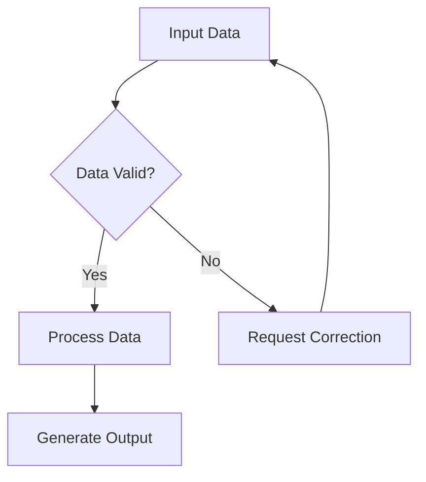

## Visual Workflows

Transform complex processes into simple, visual workflows that can be executed as custom tools within Keinsaas Navigator. No coding required - just drag, drop, and connect.

<Card
  title="Try Visual Workflows"
  icon="play"
  href="https://app.keinsaas.com"
  horizontal
>
  Experience visual workflow creation in our live demo.
</Card>

## What are Visual Workflows?

Visual workflows allow you to create automated processes by connecting different tools and actions in a visual interface. Think of them as flowcharts that actually execute tasks.

### Key Benefits

<Columns cols={2}>
  <Card
    title="🚀 No Coding Required"
    icon="code"
  >
    Build complex automations using a simple drag-and-drop interface.
  </Card>
  <Card
    title="🔄 Reusable Components"
    icon="recycle"
  >
    Create once, use everywhere. Share workflows across your organization.
  </Card>
  <Card
    title="📊 Visual Logic"
    icon="chart-line"
  >
    See the flow of your processes at a glance for easy debugging and optimization.
  </Card>
  <Card
    title="⚡ Instant Execution"
    icon="bolt"
  >
    Run workflows directly from chat with simple commands or @ mentions.
  </Card>
</Columns>

## Creating Your First Workflow

### Step 1: Access the Workflow Builder

1. Open Keinsaas Navigator
2. Click on the **Workflows** tab in the sidebar
3. Select **Create New Workflow**
4. Give your workflow a descriptive name

### Step 2: Design Your Flow

<AccordionGroup>
  <Accordion icon="plus" title="Add Input Nodes">
    Start by defining what information your workflow needs:
    
    - **Text Input**: For user-provided text
    - **File Input**: For document processing
    - **Data Input**: For structured data
    - **API Input**: For external data sources
  </Accordion>
  <Accordion icon="cog" title="Add Processing Steps">
    Connect processing nodes to transform your data:
    
    - **AI Analysis**: Use AI to analyze content
    - **Data Transformation**: Convert between formats
    - **Conditional Logic**: Add if/then decisions
    - **Loop Operations**: Repeat steps for multiple items
  </Accordion>
  <Accordion icon="output" title="Add Output Actions">
    Define what your workflow produces:
    
    - **Text Response**: Generate reports or summaries
    - **File Generation**: Create documents or images
    - **API Calls**: Send data to external services
    - **Notifications**: Alert users of completion
  </Accordion>
</AccordionGroup>

### Step 3: Test and Deploy

1. **Test Your Workflow**: Use the built-in testing tool to verify each step
2. **Save and Deploy**: Make your workflow available as a custom tool
3. **Share**: Optionally share with your team or make it public

## Common Workflow Examples

### Document Processing Workflow

<Steps>
  <Step title="Upload Document">
    User uploads a PDF or Word document
  </Step>
  <Step title="Extract Text">
    Use AI to extract and clean the text content
  </Step>
  <Step title="Analyze Content">
    Generate a summary and key insights
  </Step>
  <Step title="Create Report">
    Format the analysis into a structured report
  </Step>
  <Step title="Send Results">
    Deliver the report to the user
  </Step>
</Steps>

### Data Analysis Workflow

<Steps>
  <Step title="Import Data">
    Connect to your data source (CSV, API, database)
  </Step>
  <Step title="Clean Data">
    Remove duplicates, handle missing values
  </Step>
  <Step title="Analyze Trends">
    Use AI to identify patterns and insights
  </Step>
  <Step title="Generate Visualizations">
    Create charts and graphs automatically
  </Step>
  <Step title="Export Results">
    Save analysis and visualizations
  </Step>
</Steps>

## Advanced Features

### Conditional Logic

Add smart decision-making to your workflows:

### Loops and Iterations

Process multiple items efficiently:

- **For Each**: Apply the same process to multiple items
- **While Loop**: Continue until a condition is met
- **Batch Processing**: Handle large datasets in chunks

### Error Handling

Build robust workflows with proper error management:

- **Try/Catch Blocks**: Handle errors gracefully
- **Fallback Actions**: Provide alternative paths
- **User Notifications**: Alert users to issues
- **Retry Logic**: Automatically retry failed operations

## Integration with MCP Tools

Visual workflows seamlessly integrate with MCP (Model Context Protocol) tools:

<Columns cols={2}>
  <Card
    title="🔌 MCP Integration"
    icon="plug"
  >
    Use any MCP-compatible tool within your workflows
  </Card>
  <Card
    title="🔄 Real-time Updates"
    icon="sync"
  >
    Workflows automatically adapt when MCP tools are updated
  </Card>
  <Card
    title="📊 Tool Analytics"
    icon="chart-bar"
  >
    Track usage and performance of tools in your workflows
  </Card>
  <Card
    title="🛠️ Custom Tools"
    icon="wrench"
  >
    Create your own MCP tools and use them in workflows
  </Card>
</Columns>

## Best Practices

### Workflow Design

<AccordionGroup>
  <Accordion icon="lightbulb" title="Keep It Simple">
    Start with simple workflows and gradually add complexity. Each step should have a clear purpose.
  </Accordion>
  <Accordion icon="test-tube" title="Test Thoroughly">
    Always test your workflows with different inputs before deploying. Use the built-in testing tools.
  </Accordion>
  <Accordion icon="book" title="Document Your Workflows">
    Add clear descriptions and comments to help others understand your workflow logic.
  </Accordion>
  <Accordion icon="users" title="Consider Your Users">
    Design workflows with your end users in mind. Make them intuitive and easy to use.
  </Accordion>
</AccordionGroup>

### Performance Optimization

- **Minimize API Calls**: Batch operations when possible
- **Use Caching**: Store frequently accessed data
- **Optimize Data Flow**: Reduce unnecessary data transformations
- **Monitor Performance**: Track execution times and resource usage

## Getting Help

<Card
  title="Workflow Support"
  icon="headset"
  href="mailto:support@keinsaas.com"
  horizontal
>
  Need help creating your first workflow? Our support team is here to assist.
</Card>

<Note>
  **Pro Tip**: Start with the workflow templates available in the demo to quickly understand how visual workflows work, then customize them for your specific needs.
</Note>
