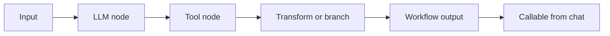

Visual workflows turn a repeatable process into a graph of inputs, LLM steps, tool calls, and outputs. Once published, the workflow appears in chat and can be invoked with `@`.

<Frame>
  
</Frame>

## How workflows work

## Common patterns

<CardGroup cols={2}>
  <Card title="Research pipelines" icon="search">
    Search, extract, summarize, and return a structured answer.
  </Card>
  <Card title="Data preparation" icon="table">
    Clean a dataset, calculate derived values, and return a chart or table.
  </Card>
  <Card title="Ticket triage" icon="inbox">
    Classify incoming work, enrich it with context, and draft the next action.
  </Card>
  <Card title="Browser checks" icon="globe">
    Use browser automation MCP tools to verify flows and capture findings.
  </Card>
</CardGroup>

## Publishing a workflow

<Steps>
  <Step title="Create the workflow">
    Add input nodes for the data the workflow needs.
  </Step>
  <Step title="Connect reasoning and tools">
    Add LLM nodes for judgment and tool nodes for external actions.
  </Step>
  <Step title="Test with realistic inputs">
    Run the workflow against the same kind of request users will send from chat.
  </Step>
  <Step title="Publish">
    Published workflows become available through `@workflow_name`.
  </Step>
</Steps>

<Frame>
  
</Frame>
