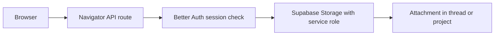

Navigator supports file uploads for chat context, user assets, generated images, and project knowledge. The current setup uses server-side storage operations so Better Auth sessions can enforce user ownership.

## Supabase configuration

```dotenv
FILE_STORAGE_TYPE=supabase
FILE_STORAGE_PREFIX=uploads
SUPABASE_URL=https://your-project.supabase.co
SUPABASE_SERVICE_ROLE_KEY=your-service-role-key
SUPABASE_AVATAR_BUCKET=avatars
SUPABASE_ATTACHMENT_BUCKET=attachments
SUPABASE_AI_GENERATED_BUCKET=Gemini Images
```

## Storage model



## Chat uploads vs project uploads

| Upload type | Purpose | Typical retention |
| --- | --- | --- |
| Chat attachment | Give the current thread file context | Temporary or thread-scoped |
| Project file | Build a searchable knowledge base | Permanent until removed |
| Generated image | Store AI-generated media | Bucket policy dependent |
| Avatar | User profile image | User-controlled |

## Security notes

<Warning>
  Never expose `SUPABASE_SERVICE_ROLE_KEY` to browser code. The client should upload through authenticated Navigator API routes.
</Warning>
