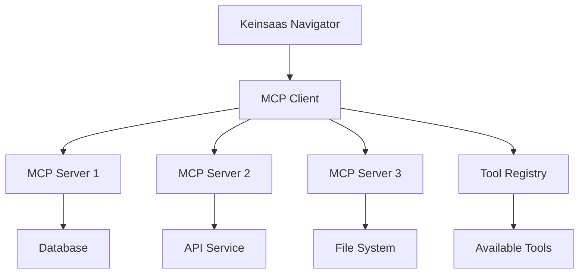

## MCP Server Setup & Tool Testing

Learn how to configure MCP (Model Context Protocol) servers and test tools to enhance your Keinsaas Navigator experience with powerful integrations and custom capabilities.

<Card
  title="Try MCP Tools"
  icon="play"
  href="https://app.keinsaas.com"
  horizontal
>
  Experience MCP tools in our live demo.
</Card>

## What is MCP?

MCP (Model Context Protocol) is a standardized protocol that allows AI assistants to securely connect to external tools and data sources. It enables Keinsaas Navigator to access a vast ecosystem of tools and services while maintaining security and reliability.

### Key Benefits

<Columns cols={2}>
  <Card
    title="🔌 Seamless Integration"
    icon="plug"
  >
    Connect to external tools and services without complex setup.
  </Card>
  <Card
    title="🛡️ Secure Access"
    icon="shield"
  >
    Secure, standardized way to access external resources.
  </Card>
  <Card
    title="🔄 Real-time Updates"
    icon="sync"
  >
    Tools update automatically and are always available.
  </Card>
  <Card
    title="🎯 Specialized Capabilities"
    icon="target"
  >
    Access specialized tools for specific domains and use cases.
  </Card>
</Columns>

## Understanding MCP Servers

### What are MCP Servers?

MCP servers are applications that provide tools and resources to AI assistants through the MCP protocol. They act as bridges between your AI assistant and external services, databases, APIs, and other resources.

<AccordionGroup>
  <Accordion icon="server" title="Server Types">
    **Different types of MCP servers**:
    
    - **Database Servers**: Connect to databases and data warehouses
    - **API Servers**: Integrate with external APIs and services
    - **File Servers**: Access and manage files and documents
    - **Analysis Servers**: Provide data analysis and processing tools
    - **Custom Servers**: Specialized servers for specific use cases
  </Accordion>
  <Accordion icon="tools" title="Tool Categories">
    **Types of tools provided by MCP servers**:
    
    - **Data Tools**: Read, write, and manipulate data
    - **Analysis Tools**: Process and analyze information
    - **Communication Tools**: Send messages, emails, notifications
    - **Integration Tools**: Connect with external services
    - **Utility Tools**: General-purpose utilities and helpers
  </Accordion>
</AccordionGroup>

### MCP Server Architecture

## Setting Up MCP Servers

### Prerequisites

<AccordionGroup>
  <Accordion icon="check" title="System Requirements">
    **Before setting up MCP servers**:
    
    - Keinsaas Navigator instance running
    - Network access to MCP servers
    - Appropriate permissions and credentials
    - Understanding of your use case requirements
  </Accordion>
  <Accordion icon="key" title="Authentication">
    **Authentication requirements**:
    
    - API keys for external services
    - Database credentials
    - OAuth tokens for third-party services
    - SSL certificates for secure connections
  </Accordion>
</AccordionGroup>

### Basic Setup Process

<Steps>
  <Step title="Identify Required Tools">
    Determine what tools and capabilities you need for your use case.
  </Step>
  <Step title="Find MCP Servers">
    Locate MCP servers that provide the required tools.
  </Step>
  <Step title="Configure Connection">
    Set up connection parameters and authentication.
  </Step>
  <Step title="Test Connection">
    Verify that the MCP server is accessible and working.
  </Step>
  <Step title="Register Tools">
    Register available tools with Keinsaas Navigator.
  </Step>
  <Step title="Test Tools">
    Test individual tools to ensure they work correctly.
  </Step>
</Steps>

### Configuration Methods

<AccordionGroup>
  <Accordion icon="cog" title="UI Configuration">
    **Configure through the interface**:
    
    1. Go to Settings → MCP Servers
    2. Click "Add New Server"
    3. Enter server details and credentials
    4. Test the connection
    5. Enable desired tools
  </Accordion>
  <Accordion icon="file" title="Configuration Files">
    **Configure via configuration files**:
    
    - JSON configuration files
    - Environment variables
    - YAML configuration
    - Database-stored configurations
  </Accordion>
  <Accordion icon="code" title="API Configuration">
    **Configure programmatically**:
    
    - REST API endpoints
    - SDK integration
    - Custom configuration scripts
    - Automated deployment tools
  </Accordion>
</AccordionGroup>

## Popular MCP Servers

### Database Servers

<AccordionGroup>
  <Accordion icon="database" title="PostgreSQL Server">
    **Connect to PostgreSQL databases**:
    
    - Query database tables
    - Execute stored procedures
    - Manage database schemas
    - Real-time data access
    
    **Use cases**: Business intelligence, reporting, data analysis
  </Accordion>
  <Accordion icon="cloud" title="MongoDB Server">
    **Connect to MongoDB databases**:
    
    - Document-based queries
    - Aggregation pipelines
    - Collection management
    - Flexible schema support
    
    **Use cases**: Content management, user data, flexible data storage
  </Accordion>
  <Accordion icon="table" title="MySQL Server">
    **Connect to MySQL databases**:
    
    - SQL query execution
    - Table management
    - User administration
    - Performance monitoring
    
    **Use cases**: Web applications, e-commerce, content management
  </Accordion>
</AccordionGroup>

### API Integration Servers

<AccordionGroup>
  <Accordion icon="globe" title="REST API Server">
    **Connect to REST APIs**:
    
    - HTTP request handling
    - Authentication management
    - Response processing
    - Error handling
    
    **Use cases**: Third-party integrations, microservices, web APIs
  </Accordion>
  <Accordion icon="envelope" title="Email Server">
    **Email integration**:
    
    - Send emails
    - Read email messages
    - Manage contacts
    - Email templates
    
    **Use cases**: Notifications, marketing, customer communication
  </Accordion>
  <Accordion icon="cloud" title="Cloud Storage Server">
    **Cloud storage integration**:
    
    - File upload/download
    - Folder management
    - Sharing and permissions
    - Version control
    
    **Use cases**: Document management, file sharing, backup
  </Accordion>
</AccordionGroup>

### Specialized Servers

<Columns cols={2}>
  <Card
    title="📊 Analytics Server"
    icon="chart-bar"
  >
    Data analysis and visualization tools
  </Card>
  <Card
    title="🤖 AI/ML Server"
    icon="brain"
  >
    Machine learning and AI model integration
  </Card>
  <Card
    title="📧 Communication Server"
    icon="comments"
  >
    Slack, Teams, and messaging integrations
  </Card>
  <Card
    title="🛒 E-commerce Server"
    icon="shopping-cart"
  >
    Online store and payment integrations
  </Card>
</Columns>

## Tool Testing

### Why Test Tools?

<AccordionGroup>
  <Accordion icon="bug" title="Identify Issues">
    **Catch problems early**:
    
    - Connection failures
    - Authentication errors
    - Data format issues
    - Performance problems
  </Accordion>
  <Accordion icon="check" title="Verify Functionality">
    **Ensure tools work as expected**:
    
    - Correct data processing
    - Expected output formats
    - Error handling
    - Edge case behavior
  </Accordion>
  <Accordion icon="gauge" title="Performance Testing">
    **Optimize tool performance**:
    
    - Response time measurement
    - Resource usage monitoring
    - Load testing
    - Scalability assessment
  </Accordion>
</AccordionGroup>

### Testing Methods

<AccordionGroup>
  <Accordion icon="play" title="Interactive Testing">
    **Test tools through the interface**:
    
    1. Go to Tools → MCP Tools
    2. Select a tool to test
    3. Provide test input
    4. Review output and results
    5. Test edge cases and error conditions
  </Accordion>
  <Accordion icon="code" title="Automated Testing">
    **Set up automated tests**:
    
    - Unit tests for individual tools
    - Integration tests for server connections
    - Performance benchmarks
    - Regression testing
  </Accordion>
  <Accordion icon="users" title="User Testing">
    **Test with real users**:
    
    - User acceptance testing
    - Usability testing
    - Feedback collection
    - Performance monitoring
  </Accordion>
</AccordionGroup>

### Test Scenarios

<Steps>
  <Step title="Basic Functionality">
    Test that tools perform their primary functions correctly
  </Step>
  <Step title="Input Validation">
    Test with various input types and edge cases
  </Step>
  <Step title="Error Handling">
    Test error conditions and recovery mechanisms
  </Step>
  <Step title="Performance">
    Test response times and resource usage
  </Step>
  <Step title="Integration">
    Test tools work together in workflows
  </Step>
  <Step title="Security">
    Test authentication and data protection
  </Step>
</Steps>

## Troubleshooting

### Common Issues

<AccordionGroup>
  <Accordion icon="exclamation-triangle" title="Connection Problems">
    **If MCP servers won't connect**:
    
    - Check network connectivity
    - Verify server URLs and ports
    - Confirm authentication credentials
    - Check firewall settings
  </Accordion>
  <Accordion icon="key" title="Authentication Errors">
    **If authentication fails**:
    
    - Verify API keys and tokens
    - Check credential expiration
    - Confirm permission levels
    - Test with different credentials
  </Accordion>
  <Accordion icon="clock" title="Performance Issues">
    **If tools are slow or unresponsive**:
    
    - Check server load and resources
    - Monitor network latency
    - Review query complexity
    - Optimize data processing
  </Accordion>
  <Accordion icon="bug" title="Tool Errors">
    **If tools produce errors**:
    
    - Check input data format
    - Verify tool parameters
    - Review error logs
    - Test with different inputs
  </Accordion>
</AccordionGroup>

### Debugging Tools

<Columns cols={2}>
  <Card
    title="📊 Connection Monitor"
    icon="wifi"
  >
    Monitor MCP server connections and status
  </Card>
  <Card
    title="📝 Log Viewer"
    icon="file-text"
  >
    View detailed logs for debugging issues
  </Card>
  <Card
    title="⚡ Performance Profiler"
    icon="gauge"
  >
    Analyze tool performance and bottlenecks
  </Card>
  <Card
    title="🔍 Error Tracker"
    icon="bug"
  >
    Track and analyze tool errors and failures
  </Card>
</Columns>

## Best Practices

### MCP Server Management

<AccordionGroup>
  <Accordion icon="lightbulb" title="Start Simple">
    Begin with basic MCP servers and gradually add complexity as needed.
  </Accordion>
  <Accordion icon="shield" title="Security First">
    Always use secure connections and proper authentication.
  </Accordion>
  <Accordion icon="test-tube" title="Test Thoroughly">
    Test all tools thoroughly before using them in production.
  </Accordion>
  <Accordion icon="book" title="Document Everything">
    Keep detailed documentation of your MCP server configurations.
  </Accordion>
</AccordionGroup>

### Tool Optimization

- **Monitor Performance**: Track tool usage and performance metrics
- **Regular Updates**: Keep MCP servers and tools updated
- **Error Handling**: Implement proper error handling and recovery
- **User Training**: Train users on how to use new tools effectively
- **Backup Plans**: Have fallback options for critical tools

## Getting Help

<Card
  title="MCP Support"
  icon="headset"
  href="mailto:support@keinsaas.com"
  horizontal
>
  Need help setting up MCP servers or troubleshooting tool issues? Our support team is here to assist.
</Card>

<Note>
  **Pro Tip**: Start with one or two essential MCP servers, get comfortable with them, then gradually expand your tool ecosystem as your needs grow.
</Note>
