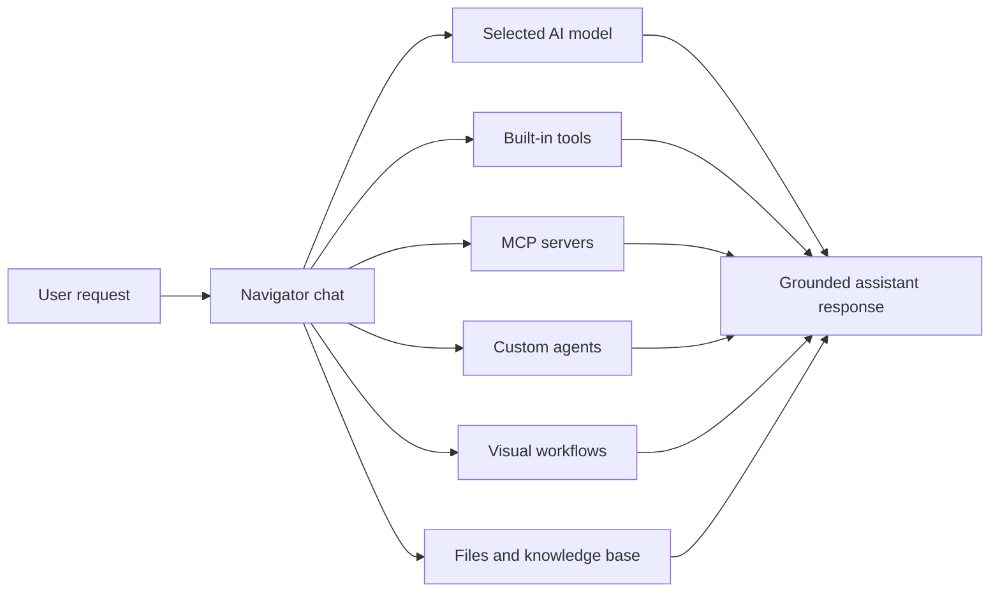

KeinSaaS Navigator is an AI workspace for running conversations, tools, agents, workflows, and project knowledge from one interface. It is built with Next.js and the Vercel AI SDK, and it supports multiple model providers including OpenAI, Anthropic, Google, xAI, OpenRouter, and local Ollama-compatible endpoints.

## Core concepts

<CardGroup cols={2}>
  <Card title="Threads" icon="message-square">
    Conversations hold the user request, assistant response, selected model, files, and tool activity.
  </Card>
  <Card title="Tools" icon="wrench">
    Built-in tools and MCP tools let the assistant search, execute code, query data, automate browsers, and call external services.
  </Card>
  <Card title="Agents" icon="robot">
    Agents package instructions, model preferences, and tool access into reusable assistants for focused tasks.
  </Card>
  <Card title="Workflows" icon="workflow">
    Visual workflows connect LLM and tool nodes, then become callable tools inside chat.
  </Card>
</CardGroup>

## How it fits together

## What to read first

<Steps>
  <Step title="Choose how you want to run it">
    Use the hosted app, run locally with `pnpm`, or deploy with Docker/Vercel.
  </Step>
  <Step title="Add one model provider">
    Navigator only needs one working AI provider key to begin. Add more providers later for model choice and fallback.
  </Step>
  <Step title="Connect useful tools">
    Start with web search or one MCP server, then add presets and agents once the first flow works.
  </Step>
  <Step title="Create repeatable workflows">
    When a task becomes routine, move it into a workflow and invoke it with `@`.
  </Step>
</Steps>

<Card title="Install Navigator" icon="terminal" href="/installation" horizontal>
  Set up dependencies, environment variables, PostgreSQL, and the local development server.
</Card>
